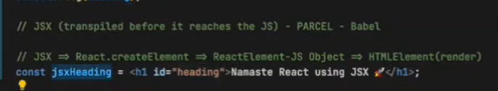
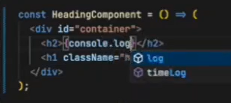

# React Learning - Day 1 🚀  

## Topics Covered  
1. Adding text using **HTML**.  
2. Adding text using **DOM Manipulation (JavaScript)**.  
3. Injecting React into an HTML file using a **CDN link**.  
4. Creating a **React Element** and rendering it inside the root `<div>`.  

## Key Concept: `React.createElement`  
React's `createElement` function returns a **JavaScript object**, which the browser interprets as an HTML element.  

### Syntax:  
```jsx
React.createElement('tagName', { props }, children);
// children to be sent wrapped in an array is just 1 child send its text

### Package Management:
- `package.json` stores project metadata and dependencies.
- `package-lock.json` locks dependency versions for consistency.
package.json where configurationa and version details of packages are there 
package-lock.json locks version keeps record of each and evry dependencie installed 
// package.json which knows summary of our project


# Episode 2 Notes: We will download bundler - parcel
which help or code keep simplified 
- **Types of Dependencies:**
  - **Dev Dependencies:** Used for development (`-D` flag).
  - **Normal Dependencies:** Needed in production.


~ VS ^
The difference between ~ and ^ in package.json is:

~ (Tilde): Allows updates for patch versions only within the same minor version.

Example: ~1.2.3 allows updates to 1.2.x (e.g., 1.2.4, 1.2.5), but not 1.3.0.

^ (Caret): Allows updates for both patch and minor versions within the same major version.

Example: ^1.2.3 allows updates to 1.x.x (e.g., 1.3.0, 1.4.0), but not 2.0.0.


We install parcel => Its dependencies are installed =>Dependencies ki dependencies are also installed.
Dependencies ki dependencies => Transitive dependencies

- **Transitive Dependencies:** Dependencies of dependencies form a dependency tree i.e transitive dependencies are the further dependencies of parcel which has furthermore dependencies and forming transitive dependencies tree is formed.

- **Regenerating `node_modules`:** Since dependencies are recorded, just running `npm install` recreates them as we have info in package.json.
Just  having package.json we can regenerate node modules so in gitignore we need to add just node_modules & package-lock.json.

## Git Basics
- Initialize a Git repository: `git init`
- Steps to push code:
  1. `git add .`
  2. `git commit -m "message"`
  3. `git push origin main`
Steps to make folder git by and steps to push 

# Step to do npm init 
## NPM Commands
- `npm init` – Initialize `package.json`
- `npm i react react-dom` – Install React
- `npm run start` – Run dev server (`parcel index.html`). Equivalent to running `npx parcel index.html`.
- `npm run start`  is same as `npm start`
- `npm run build` – Create production build (`parcel build index.html`).

- 'npx parcel index.HTML' to be added in script in package.json as in npm start start means parcel index.html 
- npx means to execute a package

Parcel is a beast
React + Parcel and other Transitive Dep are those who make the website fast as whole.

index.hmtl is the source file from which our app is created i.e parcel goes to source create a build at localhost1234
cdn link not good way and is expensive to do a network call so we will install it 
also version change will happen in our app itself when installed 
npm i react and react-dom and i ddin't used -d bec we want in app and not just in dev dependency 
so now remove cdns
and remeber to import react where react code is being used 

📌 Key Takeaways
React 17 and Below → ReactDOM.render() is used from "react-dom".
React 18+ (Latest) → ReactDOM.createRoot() is required from "react-dom/client".
Parcel/Webpack Issues → If you're using Parcel, make sure you have react-dom installed correctly.
parcel did what :
dev build 
create local server
HMR =hot module replacement i.e auto refresh on any change in files as it keeps track on our file and file watching algo is written 
parcel cache binary file and caching to keep a track whenever rebuild after server is closed and cahce parcel is there so build time is less and if not it is remade
image optimisation also done by parcel
in case of production build it bundles as well
parcel also minify js file remove console.logs we can mention if error and warn not need to be removed 
note bundler and react both make build and react website fast
and parcel compress also 
consistent hashing read about it 
and read about code spliting and differential bundling to support older browser though we can mention last how many version of any browser website should work we can use that i forgot the package 
reliable build 
tree shaking -removes unused code of our files 


Final Answer:
Parcel doesn’t always require "main": "App.js", but removing it can cause issues if:

You were running parcel src/App.js directly (instead of index.html).
Parcel needed help resolving imports inside App.js.
Your index.html didn’t explicitly load App.js as a module.
Keeping "main": "App.js" can prevent such issues, but if you prefer removing it, just make sure your HTML and Parcel commands are set up correctly
Browserlists
 "browserslist":[
    "last 2 Chrome version",
    "last 2 Firefox version"
  ] imp 

  "last 2 versions" => works for all brwoser for last 2 version of each browser

Day3: created scripts 
npm run start = npm start
npm run build  
script:

    "start":"parcel indexByReact.html",
    "build" :"parcel build indexByReact.html"
  
  No, after running parcel build, the output files are generated inside the dist folder, but they are not automatically served like in parcel serve. You need to manually serve them using a local server.so i.e npm start serves to us on local server 

  JSK was developed i.e js syntax used to write html/XML like structure being used i.e no html in js is used it is just html like syntax being used in js is jsk 
  bec const heading = React.createElement('h1',{},"Hello") is a tough synatx to write and create html sturuture
  so jsk was used.
  note jsx code is not understood by js engine it is the parcel which had babel installed which convert jsx to html which browser understand 
  
  jsx code is coverted to react.createElement( ) jese woh code likh te thei vese babel convert karta hai and then that obj is converted to html by browser
  babel transpile jsk code as per older version of browser as well 
  multiple line jsk in ().
  const head  = (
     <h1 id = "d1">
      )
 this is the way jsk is written in mutiline
 react component 
class based component - old way 
funtional based component - new way 
Reactfunctionalcomponent is a js function which returns jsx react element component
function which returns jsx is react component also functional component variable starts with capital letter 

jsk another super power is that when we write jsk or we create a functional component then in that we can write js but it should be wrapped in curly brackets {}

Even cosnsole.log works 
 